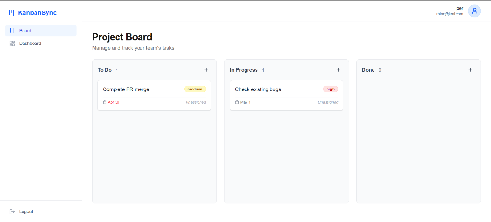

# 📋 Kanban System

A modern, high-performance Kanban board application built with Next.js 15, Drizzle ORM, and Tailwind CSS. Manage your tasks efficiently with a sleek, interactive interface featuring drag-and-drop functionality, real-time updates, and robust authentication.



## ✨ Features

- **🚀 Modern Tech Stack**: Built with Next.js 15 (App Router), React 19, and TypeScript.
- **🖱️ Drag & Drop**: Smooth task management using `@hello-pangea/dnd`.
- **🔐 Secure Authentication**: Integrated with NextAuth.js for secure user sessions and password hashing with `bcryptjs`.
- **🗄️ Database & ORM**: Powered by Neon (Serverless Postgres) and Drizzle ORM for type-safe database interactions.
- **📊 Activity Logging**: Automatically track task movements and edits for better accountability.
- **🎨 Premium UI/UX**: Styled with Tailwind CSS 4, featuring a responsive layout, beautiful typography (Inter), and Lucide React icons.
- **📅 Task Details**: Manage priorities, due dates, and descriptions with ease.

## 🛠️ Tech Stack

- **Framework**: [Next.js 15](https://nextjs.org/)
- **Styling**: [Tailwind CSS 4](https://tailwindcss.com/)
- **Database**: [Neon Postgres](https://neon.tech/)
- **ORM**: [Drizzle ORM](https://orm.drizzle.team/)
- **Auth**: [NextAuth.js v5 (Beta)](https://authjs.dev/)
- **Validation**: [Zod](https://zod.dev/)
- **Icons**: [Lucide React](https://lucide.dev/)

## 🚀 Getting Started

### Prerequisites

- Node.js 20.x or later
- A Neon Database account (or any Postgres instance)

### Installation

1. **Clone the repository:**
   ```bash
   git clone https://github.com/rhine-pereira/kanban-system.git
   cd kanban-system
   ```

2. **Install dependencies:**
   ```bash
   npm install
   ```

3. **Set up environment variables:**
   Create a `.env.local` file in the root directory and add the following:
   ```env
   DATABASE_URL=your_postgres_connection_string
   AUTH_SECRET=your_auth_secret
   NEXTAUTH_URL=http://localhost:3000
   ```

4. **Initialize the database:**
   ```bash
   npx drizzle-kit push
   ```

5. **Run the development server:**
   ```bash
   npm run dev
   ```

Open [http://localhost:3000](http://localhost:3000) with your browser to see the application.

## 📂 Project Structure

```text
src/
├── actions/     # Server actions for mutations
├── app/         # Next.js App Router (pages and layouts)
├── components/  # Reusable UI components
│   ├── board/   # Kanban board specific components
│   ├── ui/      # Base UI components (buttons, inputs, etc.)
├── db/          # Database schema and client configuration
├── lib/         # Utility functions and shared logic
└── types/       # TypeScript type definitions
```

## 📜 Available Scripts

- `npm run dev`: Starts the development server.
- `npm run build`: Builds the application for production.
- `npm run start`: Starts the production server.
- `npm run lint`: Runs ESLint for code quality checks.
- `npx drizzle-kit push`: Syncs the database schema with the Drizzle schema.

## 📄 License

This project is open-source and available under the [MIT License](LICENSE).
